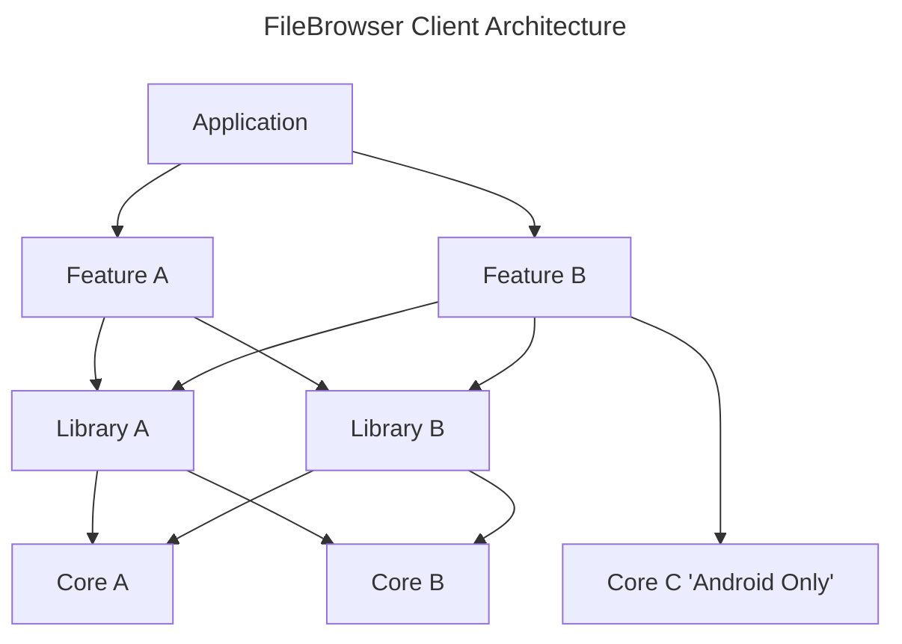

# Description
This is an app created to accommodate mobile usage of https://github.com/filebrowser/filebrowser.
Currently, I want to focus on Android application 

## Goal
- Reduce hassle to Login
- Background upload
- Multiple File Browser servers

# Architecture
The multi module architecture should be straight forward, there are 4 level of module
## Application
`Application` is the application that going to be released. It will contains all of feature needed to be delivered
This module will be contains multiple features. Application also can depends on `Library` or `Core` module for configuration purpose.
## Feature
`Feature` is a specific functionality of the `Application` that going to be released together.
`Feature` should not depends to `Application`, that will lead to **circular dependency** and will fail the build process.
`Feature` can depends to `Library` and `Core`.
## Library
`Library` is a shared module that going to be used across features, such as `Database`, `Shared Preference`, and others.
`Library` should be written in pure **Kotlin**, and avoid using **Android SDK**. This rules is to allows release to other platforms.
## Core
`Core` is pure Java, Kotlin, or Android SDK that serve the purpose of standardization, ease of code.
`Core` should never depends to other modules in the project.

